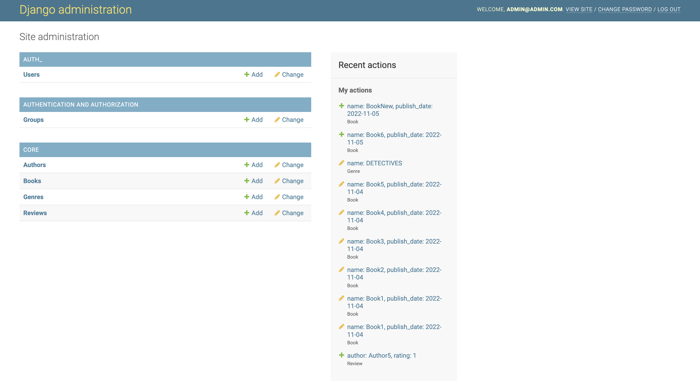
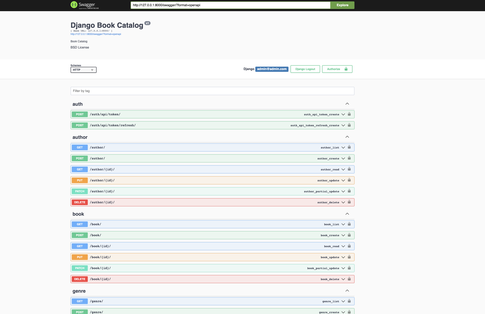
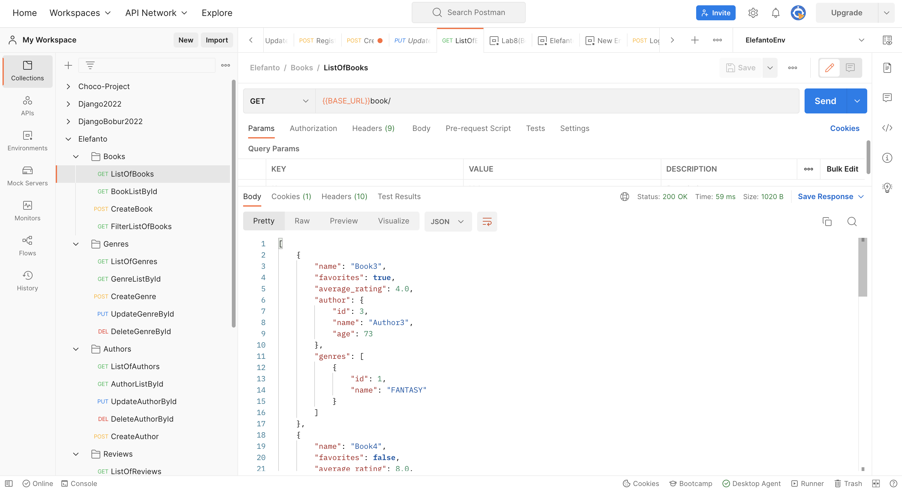

# Django App - Book Catalog
## DB Diagram
<div>
  
</div>

## Overview

### Project requirements:
- Use DRF
- Write clean code
- Build a clean architecture
- Database can use sqlite
- Endpoints should be SEO relevant (where applicable)
required) (optional, but would be a plus)
- Use drf-yasg, swagger documentation (optional)

## Exercise

 - #### Сreate a project, a catalog of books, with the ability to leave a review and rating of the book. Books should be divided by genre, authors. Main page - a list of books, with the ability to filter by genre, authors, publication date (the interval between two dates). The list should contain the title of books, genre, author, average rating. From the list, you can go to the details of the book, there should be everything that is on the list + description, publication date, and a list of reviews (author, rating, review text). The ability to add a book to favorites, also in the list of books there should be information that this book is in favorites. Registration / authorization via email (2 options, with and without confirmation). Content must be created through the admin panel.


## Quick Start

#### To get this project up and running locally on your computer:
 1. Clone the repository::
```
  $ git clone https://github.com/AA19BD/ElefantoTestProject.git
  $ cd ElefantoTestProject-main
```
 2. Set up the Python development environment. We recommend using a Python virtual environment.

```
  $ virtualenv env -p python3
  $ source env/bin/activate
```
3. Install requirements::
```
  $ pip install -r requirements.txt
```
4. Fill the DB connection params:
```
DATABASES = {
    'default': {
        'ENGINE': 'django.db.backends.postgresql_psycopg2',
        'NAME': "",

        'USER': "",

        'PASSWORD': "",

        'HOST': "localhost",

        'PORT': 5432,
    }
}
```

5. Make migrations:
```
    cd project
    python3 manage.py makemigrations
    python3 manage.py migrate
```

6. Create superuser
```
    python3 manage.py createsuperuser
```

7. Make runserver
```
    python3 manage.py runserver 
```

8. Open a browser to http://127.0.0.1:8000/admin/ to open the admin site
<div>
  
</div>

9. Create a few test objects of each type 
10. Before testing endpoints login (token)
11. Try use Postman/Swagger to test endpoints 
<div>
  
</div>

<div>
  
</div>

